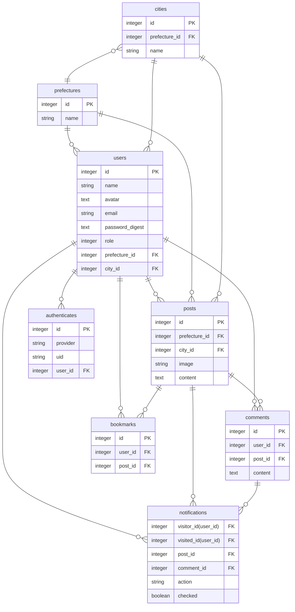

# ご当地あるあるったー（仮名）

## サービス概要
出身地や住んでいる地域の、あるある・エピソードを投稿できるサービス。 
投稿の際に都道府県と市区町村を指定する。 
トップ画面には新着投稿一覧があり、地域で絞り込んで投稿を見ることもできる。 

## このサービスへの思い・作りたい理由
自分は北海道稚内市という日本の最北端出身です。北海道はかなり広く、同じ道出身でも特色はかなり違ってきます。 
都道府県あるあるはよくありますが、市区町村のあるあるを知りたいという思いと、地元が近い人と交流ができたらいいな、という思いからサービスを考えました。

## ユーザー層について
ゆるいSNSで交流したい人。 
既存のSNSでは個としての発信力依存となり、それに疲れてしまう人もいる。 
ご当地あるあるったー（仮名）なら、最初から地域というグループに所属している状態かつ普遍的なテーマなので、投稿しやすい。

## サービスの利用イメージ
- 様々な地域のあるあるエピソードが見られる。
- 地域が近い人同士で共感でき、コメントなどで交流できる。
- 現実で人に出身地を聞いたとき、その地域の投稿一覧を見ることで話の種になる。
- 投稿を見ることで引越し先や旅行先の雰囲気を感じることができる。

## ユーザーの獲得について
X(旧Twitter)で投稿を共有できるようにして、導線を増やす。
## サービスの差別化ポイント・推しポイント
既存のSNSだと特定のおそれもあり地域の話はしにくいが、地域の話のみ投稿のサービスなので気兼ねなく住んでいる場所の話ができる。
## 使用技術一覧
- 開発環境: Docker
- サーバサイド: Ruby on Rails 7系
 Ruby 3.2.2 Rails 7.1.3
- フロントエンド: HotWire
- CSSフレームワーク: bootstrap5系
- WebAPI: [GeolocationAPI](https://developers.google.com/maps/documentation/geolocation/overview?hl=ja)、[都道府県一覧API](https://opendata.resas-portal.go.jp/docs/api/v1/prefectures.html)、[市区町村一覧API](https://opendata.resas-portal.go.jp/docs/api/v1/cities.html)
#### インフラ:
- Webアプリケーションサーバ: Heroku
- データベースサーバ: PostgresSQL

## 機能候補
#### MVPリリース
- ユーザー登録
- ログイン(devise)
- マイページ
- ユーザー情報の変更機能（ユーザー名、メールアドレス、パスワード、地域、アイコン）
- あるあるの投稿機能、投稿の削除機能
- 選択肢から都道府県・市区町村を指定して投稿する機能
- 都道府県・市区町村を指定して検索(ransack)
- トップ画面に新着一覧
- 投稿にコメント(Ajax)
- 画像アップデート(ActiveStorage)
- 「このアプリについて」ページ
#### 本リリース
- adminユーザーの投稿管理
- 位置情報で投稿地域指定(geolocation)
- いいね（あるある！）ボタン(Ajax)
- 通知機能
- パンくずリスト(gretel)
- シームレススクロール(Ajax)
- ページネーション機能(kaminari)
- 既存サービスでログイン
- 共有ボタン(X等)
- 退会機能

## 追加サービス案
- 地域検索のオートコンプリート
- タグ機能
- 通報・ブロック機能
- トップ画面に投稿があった地域の色が濃くなる日本地図を設置
- プロフィールに設定したエリアの新着投稿のトップ画面表示

## 画面遷移図
[Figma](https://www.figma.com/file/C6nwG8Amj8UWj3kLeZvxkx/%E7%94%BB%E9%9D%A2%E9%81%B7%E7%A7%BB%E5%9B%B3?type=design&node-id=0%3A1&mode=design&t=Ohwb7qEoPWtmLxvC-1)

## ER図

